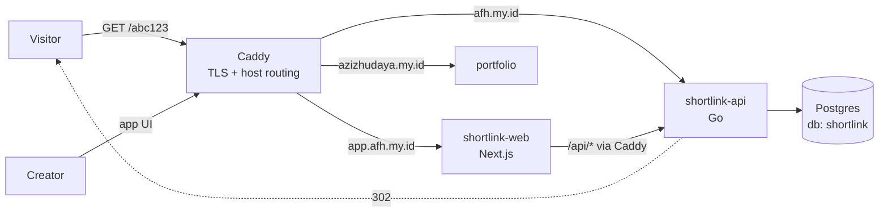
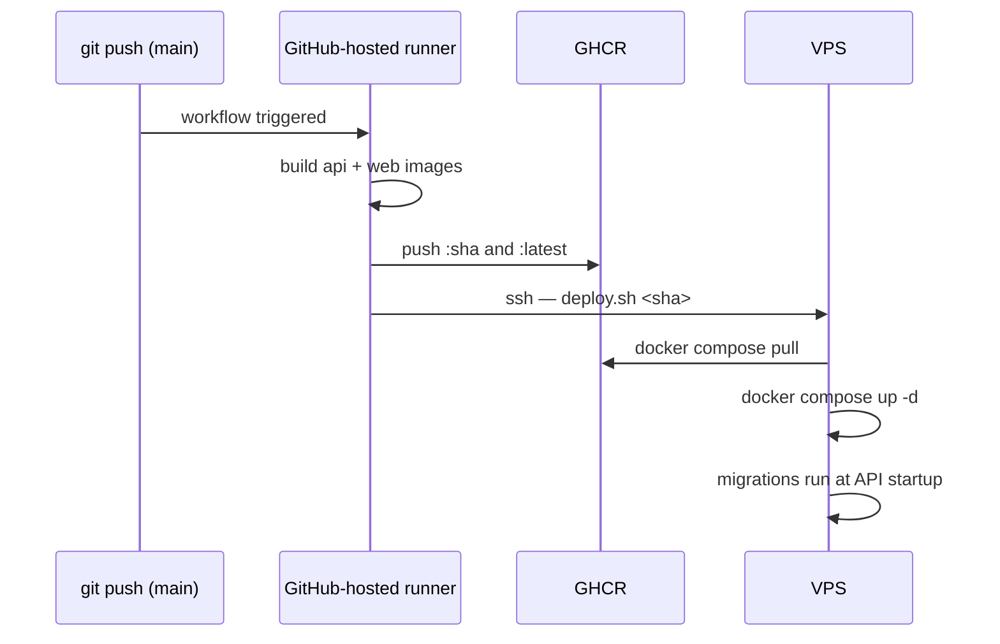

# Technical PRD — Shortlink Service (`afh.my.id`)

| | |
|---|---|
| **Product** | Shortlink — self-hosted URL shortening service |
| **Status** | Approved for build |
| **Author / Owner** | Aziz Fikri Hudaya |
| **Type** | Technical PRD (product release) |
| **Version** | 2.0 |
| **Supersedes** | v1.0 (2026-07-30) |
| **Date** | 2026-07-31 |
| **Scope** | Public release (GA) — creation, redirect, accounts, operations |

---

## Executive Summary

**One-liner:** A self-hosted link shortening service on `afh.my.id` that turns long URLs into short, durable, owner-controlled links.

**Overview.** Shortlink is a production service, not a demo. It takes a long URL and returns a short one — `afh.my.id/abc123` or a custom alias — and resolves that link reliably for anyone who follows it. Accounts give each user a private inventory of their own links with the ability to list, disable, and delete them.

The service is built on the assumption that **a short link is a durable public commitment**. Once a link is shared into a chat, a slide deck, or a printed QR code, it must keep resolving. That assumption drives every requirement in this document: availability targets over feature count, encrypted off-box backups, an explicit abuse-takedown path, and a deployment pipeline where a bad release can be rolled back in under two minutes.

Shortlink runs on a single 2 GB VPS alongside other services owned by the same operator. It shares one reverse proxy and one Postgres instance with those services, and its resource budget is fixed. This is a deliberate constraint, not a temporary state, and the non-functional requirements in §6 are set against it honestly — including an availability target of 99.5%, not 99.9%.

**Quick facts:**

| | |
|---|---|
| **Primary users** | Link creators (account holders) and link visitors (anonymous, unauthenticated) |
| **Core problem** | Long URLs are unshareable, and third-party shorteners take control of links away from the person who created them |
| **North Star metric** | Successful redirects per month |
| **Availability target** | 99.5% monthly, measured on the redirect path |
| **Target GA** | Milestone 3 complete |

---

## 1. Problem Statement

### 1.1 The problem

Long URLs are hostile to sharing. They break across lines in chat, overflow slide layouts, produce dense unscannable QR codes, and expose tracking parameters the sharer did not intend to publish. The standard fix is a public shortener — bit.ly, tinyurl, and similar.

That fix introduces a worse problem: **the link stops belonging to the person who made it.** A third-party shortener decides whether the link keeps resolving, what interstitial page appears, what data is collected from every click, and whether the service continues to exist. Shortener shutdowns are common enough to be a known category of link rot, and when one happens every link ever created dies at once — including links already printed on physical material. The person who shared the link has no recourse and usually no warning.

A branded domain also carries information the generic shorteners strip away. `afh.my.id/cv` tells a recipient who is behind the link; `bit.ly/3xK9pQ` tells them nothing, and increasingly reads as a phishing signal to cautious recipients.

### 1.2 Current state

Today the operator either shares raw long URLs, accepting the formatting and readability cost, or uses a public shortener and accepts the loss of control. The domain `afh.my.id` is registered and unused. Infrastructure to host a service — a VPS with a reverse proxy and a database — is already provisioned and running.

### 1.3 Impact

**User impact.** Recipients receive links that are hard to read, hard to trust, and hard to type from a printed or displayed surface. Creators cannot fix a link after sharing it: a mistyped destination or a moved page means the shared link is permanently wrong.

**Operational impact.** Links shared through third parties cannot be inventoried, audited, or retired. There is no single place to answer "what have I shared, and where does it point now?"

### 1.4 Why now

The domain is registered and incurring renewal cost while idle. The hosting substrate — VPS, Caddy, Postgres, deployment pipeline — is already in place and shared with other services, so the marginal infrastructure cost of this product is close to zero. Both inputs are paid for and unused.

---

## 2. Goals & Objectives

### 2.1 Product goals

1. **Durable links.** A link created today resolves years from now. Measured by availability (§6, NFR-002) and by backup/restore capability (§12.3).
2. **Owner control.** Every link has an owner who can inspect, disable, and delete it, and no one else can. Measured by authorization test coverage on all ownership-scoped endpoints.
3. **Trustworthy destination.** The service must not become a phishing conduit. A domain-level blocklisting event is treated as a critical failure, not an inconvenience (§13).
4. **Low operational burden.** Deployment is a `git push`; recovery from a bad release is one command. Routine operation should require no manual intervention in a normal month.

### 2.2 User goals

1. Convert a long URL into a short one in a single action, and copy the result without leaving the page.
2. Choose a memorable alias when the link will be spoken, typed, or printed.
3. See every link created, and retire the ones no longer wanted.
4. Follow a shared short link and arrive at the destination without an interstitial, a consent prompt, or a delay.

### 2.3 Non-goals

- Competing with commercial shorteners on features or scale.
- Serving as a shortening service for the general public. Registration is closed (§13.2).
- Click analytics, campaign attribution, or UTM management in this release (§4.2).
- Multi-tenant billing, teams, or shared link ownership.
- High availability. The service is a single instance on a single host by design (§17).

---

## 3. Users & Personas

### 3.1 Primary — Creator

An authenticated account holder who creates and manages links. Technically capable, uses the service from both desktop and mobile, and often needs the resulting link inside 10 seconds to paste into a conversation already in progress.

**Needs:** speed, a copyable result, memorable aliases for links that will be spoken or printed, and a reliable list of everything previously created.

**Pain today:** no inventory of shared links; no way to correct or retire a link after sharing.

### 3.2 Primary — Visitor

Anyone who follows a short link. Never authenticates, never sees the application UI, and in most cases does not know a shortener is involved. Arrives from a chat client, an email, a slide, or a QR code.

**Needs:** to land on the intended destination immediately. A visitor's entire experience of this product is a redirect that either works or does not.

**Pain today:** none, provided the redirect works. This persona defines the availability requirement — visitor traffic is the only traffic that cannot be retried later by a cooperative user.

### 3.3 Secondary — Operator

The person running the service. Deploys releases, responds to abuse reports, restores from backup, and holds the domain reputation risk.

**Needs:** deployments that cannot silently corrupt data, a fast rollback, alerting before users notice, and a takedown mechanism that works in under a minute.

---

## 4. Scope

### 4.1 In scope

**Milestone 1 — Redirect core**
- Create a short link from a long URL, with an auto-generated code
- Custom aliases with format validation and collision handling
- Public `GET /{code}` redirect
- Single-page creation UI with copy-to-clipboard

**Milestone 2 — Accounts and ownership**
- Email + password registration behind an invite code
- Session-based login and logout
- Link creation requires authentication; links are stamped with an owner
- Per-user link listing, disable, and delete

**Milestone 3 — Production readiness (GA gate)**
- Automated deploy pipeline with tagged images and one-command rollback
- Encrypted off-box backups with a verified restore
- Health endpoint, uptime monitoring, and alerting
- Security hardening per §10 completed and verified
- Abuse takedown path tested end to end

### 4.2 Out of scope

| Excluded | Why |
|---|---|
| Click analytics and counters | Adds a write on the hottest path and a caching layer to keep it fast. The redirect stays a single indexed read in this release. 302 preserves the option (§9.2). |
| Link expiry and scheduled deactivation | Manual disable covers the real need. Revisit if a use case appears. |
| QR code generation | Any external generator handles this. No reason to own it. |
| Bulk import/export | Not needed at expected link volume. |
| Password-protected or one-time links | Meaningful additional threat surface for a use case that has not come up. |
| Open public registration | Directly conflicts with the abuse posture in §13. |
| OAuth / social login | Adds a third-party dependency and a failure mode; email + password is sufficient for a closed user set. |
| Custom domains per user | Single-tenant product. |

### 4.3 Future considerations

Ranked by likely value: click counting with a cache in front of the write path; link editing (changing a destination after creation); tagging and search over the link list; a public API with per-user tokens; automated destination reachability checks.

---

## 5. User Stories & Requirements

### 5.1 P0 — Must have

---

#### Story 1 — Shorten a URL

```
As a Creator,
I want to paste a long URL and receive a short one,
So that I can share it without the URL dominating the message.
```

**Acceptance criteria**
- [ ] Given a valid `http`/`https` URL, when submitted, then a 7-character base62 code is returned with the full short URL displayed
- [ ] Given the response, when it renders, then a copy control places the short URL on the clipboard in one action
- [ ] Given a URL with no scheme (`example.com/page`), when submitted, then `https://` is assumed and the link is created
- [ ] Given a `javascript:`, `data:`, or `file:` URL, when submitted, then creation is rejected with a clear message
- [ ] Given a URL pointing at `afh.my.id` or `app.afh.my.id`, when submitted, then creation is rejected to prevent redirect loops
- [ ] Given a URL resolving to a private or loopback address, when submitted, then creation is rejected
- [ ] Given a generated code that collides with an existing row, when insertion fails, then generation retries up to 5 times before returning an error

**Priority:** P0 · **Effort:** M · **Depends on:** database schema

---

#### Story 2 — Follow a short link

```
As a Visitor,
I want a short link to take me to its destination immediately,
So that the shortener is invisible to me.
```

**Acceptance criteria**
- [ ] Given an active code, when requested, then a 302 with `Location: <long_url>` is returned
- [ ] Given an unknown code, when requested, then 404 is returned with a plain, non-technical page
- [ ] Given a disabled code, when requested, then 410 Gone is returned
- [ ] Given any redirect, when served, then no interstitial, consent prompt, or JavaScript execution occurs
- [ ] Given any redirect, when served, then `Referrer-Policy: no-referrer` is set so the destination does not learn the short URL
- [ ] Given a code differing only in letter case from an existing one, when requested, then it is treated as distinct (codes are case-sensitive)

**Priority:** P0 · **Effort:** S

---

#### Story 3 — Custom alias

```
As a Creator,
I want to choose my own alias,
So that the link is memorable when spoken, typed, or printed.
```

**Acceptance criteria**
- [ ] Given an alias of 3–32 characters matching `^[a-zA-Z0-9_-]+$`, when submitted, then it is used verbatim as the code
- [ ] Given an alias already in use, when submitted, then 409 Conflict is returned and **no substitute code is silently created**
- [ ] Given an alias on the reserved list (§9.3), when submitted, then 400 is returned
- [ ] Given an alias failing the format rule, when submitted, then 400 names the specific violation

**Priority:** P0 · **Effort:** S

---

#### Story 4 — Register with an invite

```
As an invited person,
I want to create an account,
So that I can own links on this service.
```

**Acceptance criteria**
- [ ] Given a valid unused invite code, when registering with an email and a password of at least 12 characters, then the account is created and the invite is marked consumed
- [ ] Given an invalid, consumed, or expired invite code, when registering, then registration is refused
- [ ] Given an email already registered, when registering, then the response does not reveal whether the address exists
- [ ] Given a successful registration, when the record is written, then the password is stored as an argon2id hash and the plaintext appears in no log or error message

**Priority:** P0 · **Effort:** M

---

#### Story 5 — Log in and out

```
As a Creator,
I want to authenticate,
So that only I can manage my links.
```

**Acceptance criteria**
- [ ] Given correct credentials, when submitted, then a session cookie is set with `HttpOnly`, `Secure`, `SameSite=Lax`
- [ ] Given incorrect credentials, when submitted, then 401 is returned with a message that does not distinguish wrong email from wrong password
- [ ] Given 5 failed attempts for one account within 15 minutes, when a 6th is made, then it is refused regardless of source IP
- [ ] Given logout, when invoked, then the session row is deleted server-side and the cookie is cleared
- [ ] Given a session older than 30 days, when used, then it is rejected and the row is purged

**Priority:** P0 · **Effort:** M

---

#### Story 6 — Authenticated creation with ownership

```
As a Creator,
I want my links stamped as mine,
So that no one else can manage them.
```

**Acceptance criteria**
- [ ] Given no valid session, when creation is attempted, then 401 is returned
- [ ] Given a valid session, when a link is created, then the row records the authenticated user as owner
- [ ] Given a link owned by another user, when any management operation is attempted, then 404 is returned — **not 403** — so link existence is not disclosed

**Priority:** P0 · **Effort:** S · **Depends on:** Stories 4, 5

---

#### Story 7 — List and manage links

```
As a Creator,
I want to see every link I have created and retire the ones I no longer want,
So that I have a real inventory rather than a set of links I have lost track of.
```

**Acceptance criteria**
- [ ] Given a valid session, when the list is requested, then only that user's links are returned, newest first
- [ ] Given more than 50 links, when the list is requested, then results are paginated
- [ ] Given a link is disabled, when its code is followed, then 410 is returned and the code remains reserved (not reusable)
- [ ] Given a link is deleted, when the operation completes, then the row is removed and the code becomes available again
- [ ] Given a delete action, when triggered in the UI, then a confirmation is required

**Priority:** P0 · **Effort:** M

---

#### Story 8 — Emergency takedown

```
As the Operator,
I want to disable any link immediately regardless of owner,
So that an abusive destination stops resolving before it damages the domain's reputation.
```

**Acceptance criteria**
- [ ] Given any code, when the operator disables it, then the redirect returns 410 within one request
- [ ] Given a takedown, when performed, then the actor, timestamp, and reason are recorded
- [ ] Given the application is unreachable, when a takedown is urgent, then the same result is achievable via direct SQL — documented in the runbook (§12.5)

**Priority:** P0 · **Effort:** S

---

### 5.2 P1 — Should have

| Story | Acceptance summary |
|---|---|
| **Rate-limited creation** | Per-user and per-IP limits on create; 429 with `Retry-After` when exceeded |
| **Destination preview in list** | Each list row shows the destination host and truncated path, so the owner can identify a link without expanding it |
| **Session list and revoke** | A user can see active sessions and revoke them individually |

### 5.3 P2 — Nice to have

| Story | Acceptance summary |
|---|---|
| **Dark mode** | Follows `prefers-color-scheme` |
| **Keyboard-first creation** | Paste, `Enter`, and the result is on the clipboard without a mouse |

---

### 5.4 Functional requirements

| ID | Requirement | Priority |
|---|---|---|
| FR-01 | Generate a unique 7-character base62 code from a CSPRNG | P0 |
| FR-02 | Accept an optional custom alias, 3–32 chars, `^[a-zA-Z0-9_-]+$` | P0 |
| FR-03 | Reject non-`http(s)` schemes, own-domain targets, and private/loopback addresses | P0 |
| FR-04 | Reject aliases on the reserved list (§9.3) | P0 |
| FR-05 | Return 409 on alias collision without substituting a code | P0 |
| FR-06 | Retry generated-code collisions up to 5 times, then fail | P0 |
| FR-07 | `GET /{code}` returns 302 on hit, 404 on miss, 410 on disabled | P0 |
| FR-08 | Registration requires a valid single-use invite code | P0 |
| FR-09 | Passwords hashed with argon2id; never logged | P0 |
| FR-10 | Sessions stored server-side as a hash of the token; revocable | P0 |
| FR-11 | Creation and all management endpoints require authentication | P0 |
| FR-12 | Ownership-scoped operations return 404 for non-owned resources | P0 |
| FR-13 | Owner can list, disable, and delete their own links | P0 |
| FR-14 | Operator can disable any link and the action is auditable | P0 |
| FR-15 | Redirects are public and never require authentication | P0 |
| FR-16 | Per-user and per-IP rate limiting on create and login | P1 |
| FR-17 | Health endpoint reporting process and database reachability | P0 |

### 5.5 Non-functional requirements

| ID | Category | Requirement | Target |
|---|---|---|---|
| NFR-01 | Performance | Redirect server processing time | p95 < 50 ms |
| NFR-02 | Availability | Monthly uptime on the redirect path | ≥ 99.5% |
| NFR-03 | Performance | Redirect end-to-end from Indonesia | p95 < 300 ms |
| NFR-04 | Capacity | Sustained redirect throughput | 50 req/s sustained, 200 req/s burst |
| NFR-05 | Capacity | Stored links without architecture change | 100,000 |
| NFR-06 | Resource | Total container memory for this service | ≤ 320 MB steady state |
| NFR-07 | Durability | Recovery point objective | ≤ 24 hours |
| NFR-08 | Durability | Recovery time objective | ≤ 4 hours |
| NFR-09 | Deployment | Rollback to previous release | ≤ 2 minutes, single command |
| NFR-10 | Deployment | Downtime per release | ≤ 5 seconds |
| NFR-11 | Security | All traffic over TLS 1.2+ with HSTS | Enforced |
| NFR-12 | Security | Takedown of an abusive link | ≤ 60 seconds from decision |
| NFR-13 | Accessibility | Creation UI | WCAG 2.1 AA |
| NFR-14 | Compatibility | Creation UI | Current Chrome, Firefox, Safari; mobile viewports from 320 px |

**Note on NFR-02.** 99.5% is chosen deliberately over a higher figure. The service is one container, on one host, with one database — a VPS reboot or a host incident causes downtime with no failover. Claiming 99.9% would require redundancy that is explicitly out of scope (§17). 99.5% allows roughly 3.6 hours of downtime per month, which the single-host topology can honestly support.

---

## 6. Success Metrics

### 6.1 North Star

**Successful redirects per month** — count of `GET /{code}` requests returning 302.

This is the only metric that measures delivered value. A link that is created but never followed produced nothing; a link followed a thousand times did its job a thousand times. It also cannot be inflated by the operator's own activity in any meaningful way.

**Baseline:** 0 (pre-launch). **Target:** a non-zero and non-declining monthly figure by the second month after GA. Absolute volume is not a goal for a single-tenant service.

### 6.2 Supporting metrics

| Metric | Definition | Target | Cadence |
|---|---|---|---|
| Redirect availability | Successful probes ÷ total probes | ≥ 99.5% | Monthly |
| Redirect p95 latency | Server processing time | < 50 ms | Weekly |
| Redirect error rate | 5xx ÷ total redirect requests | < 0.1% | Weekly |
| Deploy success rate | Pipeline runs reaching a healthy service | ≥ 95% | Monthly |
| Mean time to recovery | Alert fired — service healthy | < 30 min | Per incident |
| Backup restore verification | Restore drill performed and passed | 1 per quarter | Quarterly |
| Abuse incidents | Links disabled for abuse | 0 | Monthly |
| Domain reputation | Safe Browsing status for `afh.my.id` | Clean | Weekly |

### 6.3 Instrumentation

Availability and latency are measured by an **external uptime probe** hitting a canary short code every 60 seconds. External measurement is required — a monitor running on the same VPS reports success right up until the host dies. Application-side, structured JSON logs to stdout carry method, path, status, duration, and a request ID; `docker logs` with a size-capped rotating driver is the retention mechanism. No log aggregation stack — it would not fit the memory budget (NFR-06).

---

## 7. System Architecture

### 7.1 Deployment topology

Shortlink is one tenant on a shared single-host platform. A separate infrastructure repository owns the reverse proxy, the database, and the Docker networks; each application repository owns only its own containers and attaches to networks it does not create.

```
/srv/infra/        — repo: afh-infra    Caddy + Postgres + networks
/srv/shortlink/    — repo: shortlink    Go API + Next.js web
/srv/portfolio/    — repo: portfolio    (co-tenant)
```



**Two networks, not one.** `edge` carries Caddy-to-application traffic; `data` carries application-to-database traffic. Only `shortlink-api` joins both. The web container and co-tenant services have no network path to Postgres at all.

**No published ports except Caddy.** Containers expose ports only on the internal Docker networks. This is a hard rule, not a default: Docker writes its own iptables rules ahead of UFW's, so a published port bypasses the host firewall silently. Database access for maintenance goes through an SSH tunnel (§12.5).

**Explicit container names.** Compose derives a network alias from the service name, so two projects each defining a service called `web` would collide on the shared `edge` network and Caddy would resolve to an arbitrary container. Every service therefore declares `container_name` (`shortlink-api`, `shortlink-web`), and Caddy routes to those names.

### 7.2 Repository model

Shortlink is developed and released as **three independent repositories, not a monorepo**. The boundary between them is deployment lifecycle, not programming language: `shortlink` contains both a Go service and a Next.js application because they ship together, while Caddy and Postgres live elsewhere because they do not.

| Repository | Owns | Visibility | Release cadence | Blast radius of a bad change |
|---|---|---|---|---|
| `afh-infra` | Caddy config, Postgres, Docker networks, host provisioning, backup jobs | **Private** | Rare — measured in months | Every service on the host, including the database |
| `shortlink` | Go API, Next.js UI, migrations, this PRD | Public | Frequent — per feature | This product only |
| `portfolio` | Co-tenant static site | Public | Occasional | That site only |

#### Why not a monorepo

**Change frequency and risk are inverted between the two kinds of code.** Application changes are frequent, cheap, and reversible in two minutes (NFR-09). Infrastructure changes are rare, dangerous, and can take down every co-tenant at once. Putting both behind one pipeline means either every application push carries the ability to touch Caddy and Postgres configuration, or the repository accumulates path filters to prevent exactly that — reconstructing the split without its benefits.

**Visibility requirements differ.** §10.1 requires the application repositories to be public. The infrastructure repository is the opposite: it documents host topology, firewall assumptions, backup destinations, and container-level trust boundaries. None of that is secret in the credential sense, and none of it should be a free reconnaissance document either. A monorepo forces one visibility setting on both, and the safe resolution — everything private — would forfeit the unlimited CI minutes and unmetered image storage that CD-06 depends on.

**The co-tenants are unrelated products.** `portfolio` shares a host with Shortlink and nothing else. It has its own history and its own reasons to change. A repository containing both would require anyone working on either to hold access to the whole platform.

**Independent pipelines are the payoff** (CD-07). A push to `shortlink` builds and deploys only Shortlink. Infrastructure containers are never recreated by an application release.

#### The platform contract

Multi-repo means the coupling between repositories is real but invisible — nothing in `shortlink` fails to compile when `afh-infra` renames a network. These are the interfaces each application repository depends on. They are recorded in the `afh-infra` README as the single source of truth, and this table is a copy, not the original.

| Contract item | Defined by | Consumed by | Symptom if violated |
|---|---|---|---|
| Networks named `edge` and `data` | `afh-infra` | App compose declares them `external: true` | `docker compose up` fails immediately — the loud failure, and the harmless one |
| Container names are globally unique across all repos | Convention, registry in `afh-infra` README | Caddy `reverse_proxy` targets | Caddy resolves to an arbitrary container. Silent, intermittent, and the worst failure in this list |
| Hostname routing entries | `afh-infra` Caddyfile | — | A new hostname requires an infrastructure change; an application cannot self-register a route |
| Postgres role and database per tenant | `afh-infra` `initdb/` on first boot, or manual `psql` afterwards | App connection string | API fails at startup on migration |
| Image naming `ghcr.io/<owner>/<repo>-<component>:<sha>` | Convention | `deploy.sh`, compose `image:` | Pull failure at deploy |
| Deploy entrypoint at `/srv/<app>/deploy.sh` | Convention | SSH forced command (SEC-11) | Deploy step rejected |

| ID | Platform requirement |
|---|---|
| PLT-01 | `afh-infra` is applied before any application deploy. Application compose files declare networks as external and cannot create them. |
| PLT-02 | Container names are globally unique across repositories and registered in the `afh-infra` README before first use. |
| PLT-03 | An application repository never defines a published host port, a network, or a database service. |
| PLT-04 | Adding a tenant requires an `afh-infra` change: a Caddy route, and a Postgres role and database. |
| PLT-05 | A tenant added after the Postgres volume was initialised is provisioned manually — `initdb/` scripts run only on first volume creation and will not execute for later tenants. |
| PLT-06 | Contract changes affecting a live tenant are deployed infrastructure-first, then application, and never in a single step. |

PLT-05 is the item most likely to cause a confusing first failure: the SQL file sits in the repository, appears to be applied, and never runs.

#### Accepted weaknesses

**No atomic cross-repo change.** Renaming a container requires coordinated commits in two repositories, and no pipeline detects the mismatch — Caddy simply returns 502 until both land. Mitigated by PLT-06 ordering and by a post-deploy smoke check against the canary code (§12.2), which converts a silent misroute into a fired alert.

**The contract is convention, not enforcement.** Nothing mechanically prevents an application repository from publishing a port or creating a network. This is accepted for a single-operator platform; the pre-launch external port scan (§15.1) is the compensating control, and it verifies the outcome rather than trusting the configuration.

### 7.3 Hostname routing

| Hostname | Served by | Purpose |
|---|---|---|
| `afh.my.id` | `shortlink-api` | Public redirects — `GET /{code}` |
| `app.afh.my.id` | `shortlink-web`, with `/api/*` — `shortlink-api` | Creation and management UI |

Routing `/api/*` on the app hostname back to the API container makes every browser request same-origin. This removes CORS from the system entirely rather than configuring it — no preflight requests, no origin allowlist to maintain, no cross-origin cookie complications.

### 7.4 Technology decisions

| Component | Choice | Rationale |
|---|---|---|
| API | Go, stdlib `net/http` | Go 1.22+ routes path parameters natively. A static binary in a distroless image gives a container with near-zero attack surface at ~25 MB resident. |
| Database | Postgres 16, shared instance, dedicated database and role | A unique constraint provides collision safety with no application locking. A second Postgres instance would cost ~150 MB idle — unaffordable under NFR-06. |
| Frontend | Next.js, `output: 'standalone'` | Small runtime image; the UI is deliberately minimal. |
| Reverse proxy | Caddy | Automatic TLS for both hostnames and host-based routing in a few lines. The component that makes single-host multi-tenancy work. |
| Migrations | golang-migrate, embedded, run at API startup | Guarantees migrate-then-serve ordering. Running migrations as a separate pipeline step allows a window where new schema and old code coexist. |

### 7.5 Resource budget

| Component | Steady state | Limit |
|---|---|---|
| Caddy (shared) | ~25 MB | 128 MB |
| Postgres (shared, tuned) | ~200 MB | 384 MB |
| `shortlink-api` | ~25 MB | 96 MB |
| `shortlink-web` | ~120 MB | 192 MB |
| OS + dockerd | ~350 MB | — |
| **Headroom** | **~1.2 GB** | |

Every application container declares a memory limit. Without limits, one leaking process takes down every co-tenant service on the host, including the database.

---

## 8. Data Model

### 8.1 Schema

```sql
create table users (
    id            bigserial   primary key,
    email         text        not null,
    password_hash text        not null,
    is_active     boolean     not null default true,
    created_at    timestamptz not null default now()
);
create unique index users_email_lower_key on users (lower(email));

create table invites (
    code        text        primary key,
    created_by  bigint      references users(id) on delete set null,
    consumed_by bigint      references users(id) on delete set null,
    consumed_at timestamptz,
    expires_at  timestamptz not null,
    created_at  timestamptz not null default now()
);

create table sessions (
    token_hash bytea       primary key,
    user_id    bigint      not null references users(id) on delete cascade,
    expires_at timestamptz not null,
    created_at timestamptz not null default now(),
    user_agent text,
    ip         inet
);
create index sessions_user_id_idx    on sessions (user_id);
create index sessions_expires_at_idx on sessions (expires_at);

create table links (
    short_code    varchar(32) primary key,
    long_url      text        not null,
    is_custom     boolean     not null default false,
    user_id       bigint      references users(id) on delete cascade,
    disabled_at   timestamptz,
    disabled_by   text,
    disable_reason text,
    created_at    timestamptz not null default now()
);
create index links_user_id_created_at_idx on links (user_id, created_at desc);
```

### 8.2 Design notes

**`short_code` is the primary key.** The redirect is the hottest path in the system and it looks up by code. Making the code the primary key means that lookup is an index-only probe on the clustered key with no surrogate-key indirection. A `bigserial id` would add a second index for no benefit — nothing in the product references a link by numeric id.

**Session tokens are stored hashed.** The client holds a 32-byte random value; the database holds its SHA-256. A database disclosure therefore does not hand over usable sessions. This costs one hash per authenticated request.

**`user_id` is nullable** so Milestone 1 links created before accounts exist survive the Milestone 2 migration without a backfill or a breaking change.

**`disabled_at` rather than deletion for takedowns.** A disabled code stays in the table, so it cannot be re-registered by whoever caused the takedown. Owner-initiated deletion does remove the row and free the code — different intent, different mechanism.

**No `click_count`.** Deliberately absent. Adding a counter turns every redirect from one read into a read plus a write, which is the single change most likely to break NFR-01. When analytics arrive they will be a separate append-only table with a cache in front, not a column here.

**No PII beyond email.** Session rows record IP and user agent for revocation and abuse review, with a 30-day lifetime tied to session expiry. Redirects are not logged with visitor identifiers (§14).

---

## 9. API Specification

### 9.1 Endpoints

**Public**

| Method | Path | Response |
|---|---|---|
| `GET` | `/{code}` | 302 + `Location` · 404 unknown · 410 disabled |
| `GET` | `/healthz` | 200 with process and database status |

**Authentication** — all on `app.afh.my.id/api`

| Method | Path | Response |
|---|---|---|
| `POST` | `/api/auth/register` | 201 · 400 invalid · 403 bad invite |
| `POST` | `/api/auth/login` | 200 + session cookie · 401 · 429 |
| `POST` | `/api/auth/logout` | 204 |

**Links** — authenticated

| Method | Path | Response |
|---|---|---|
| `POST` | `/api/links` | 201 · 400 · 409 alias taken · 429 |
| `GET` | `/api/links?cursor=&limit=` | 200, owner-scoped, paginated |
| `PATCH` | `/api/links/{code}` | 204 disable/enable · 404 not owned |
| `DELETE` | `/api/links/{code}` | 204 · 404 not owned |

### 9.2 Create request and response

```json
POST /api/links
{
  "url": "https://example.com/some/very/long/path?with=query",
  "custom_alias": "cv"
}
```

```json
201 Created
{
  "code": "cv",
  "short_url": "https://afh.my.id/cv",
  "long_url": "https://example.com/some/very/long/path?with=query",
  "is_custom": true,
  "created_at": "2026-07-31T10:00:00Z"
}
```

Errors are a consistent shape — `{"error": {"code": "ALIAS_TAKEN", "message": "..."}}` — so the frontend branches on a stable machine-readable code rather than on message text.

### 9.3 Redirect semantics

**302, not 301.** Browsers cache 301 responses aggressively and often indefinitely. A cached 301 means the browser stops contacting the server, which makes takedown (Story 8, NFR-12) unenforceable for anyone who has followed the link before — exactly the population that matters during an abuse incident. It would also make any future click counting silently wrong. 302 forces every click through the server at a cost of one indexed read.

**Reserved prefixes.** Custom aliases are checked against a single list held in one place in the API:

```
api  app  admin  login  logout  signup  register  auth  healthz  status
static  assets  _next  favicon.ico  robots.txt  sitemap.xml  .well-known
```

Generated base62 codes cannot collide with these by construction, so the check applies to custom aliases only.

---

## 10. Security Requirements

Ordered by risk. The first three are the ones capable of ending the product.

### 10.1 Repository and secret hygiene

The application repositories are **public** and `afh-infra` is **private** (§7.2). Public application repositories make secret exposure the highest-consequence failure in the system and means any exposure is immediate and irreversible — public repositories are scraped by bots within minutes.

| Requirement | Detail |
|---|---|
| SEC-01 | No credential in Git history. Audit before publication; `.gitignore` does not remove what is already committed. |
| SEC-02 | Any credential ever committed is rotated, not just removed. |
| SEC-03 | Secret scanning and push protection enabled on every repository. |
| SEC-04 | `.env`, `initdb/*.sql`, and key material are gitignored; `.env.example` carries placeholders only. |
| SEC-05 | Runtime secrets live only on the VPS, mode `0600`, owned by the deploy user. |

### 10.2 Network exposure

| Requirement | Detail |
|---|---|
| SEC-06 | UFW default-deny inbound; only 22, 80, 443 open. |
| SEC-07 | No container publishes a host port except Caddy. Verified by external port scan, not by reading the compose file. |
| SEC-08 | Database access for maintenance via SSH tunnel only. |
| SEC-09 | SSH: key-only, no root login, no password or keyboard-interactive authentication. |
| SEC-10 | `fail2ban` and `unattended-upgrades` installed and active. |

### 10.3 Abuse resistance

Covered in full in §13. The security-relevant controls: authenticated creation only, closed registration, scheme and destination validation, unguessable codes from a CSPRNG, and rate limiting.

### 10.4 Deployment chain

| Requirement | Detail |
|---|---|
| SEC-11 | The CI deploy key is restricted to a single forced command; `restrict` disables forwarding, PTY, and agent access. |
| SEC-12 | `deploy.sh` validates its argument against `^[0-9a-f]{40}$` before use. Membership in the `docker` group is equivalent to root, so an unvalidated argument is a root-level injection point. |
| SEC-13 | Third-party GitHub Actions are pinned to a commit SHA, never a tag. Git tags can be silently repointed — the mechanism behind the `tj-actions/changed-files` compromise. Dependabot keeps pins current. |
| SEC-14 | Workflow-level `permissions: {}`, widened per job to the minimum needed. |
| SEC-15 | `pull_request_target` is never used. On a public repository it grants fork-authored code access to secrets. |
| SEC-16 | The Docker socket is never mounted into a container. This rules out socket-based auto-updaters. |

### 10.5 Container hardening

Go builds to a static binary in `gcr.io/distroless/static-debian12:nonroot`. All application containers run with `no-new-privileges`, `cap_drop: [ALL]`, a read-only root filesystem with tmpfs where writes are required, and a `pids_limit`.

### 10.6 Application security

| Area | Requirement |
|---|---|
| Password hashing | argon2id, `m=19MiB, t=2, p=1`. Concurrency is bounded so a login burst cannot exhaust the memory budget. |
| Session cookie | `HttpOnly`, `Secure`, `SameSite=Lax`, 30-day expiry, server-side revocable |
| CSRF | `SameSite=Lax` plus a token on state-changing requests |
| Login throttling | Per-account **and** per-IP. Per-IP alone is trivially bypassed against a single known account. |
| SQL | Parameterized queries exclusively |
| Request size | Capped at 1 MB at the proxy |
| Response headers | HSTS with `includeSubDomains`, `X-Content-Type-Options: nosniff`, `Referrer-Policy: no-referrer`, `X-Frame-Options: DENY`, server header suppressed |

`Referrer-Policy: no-referrer` matters more here than in a typical application: without it, every destination site learns the short URL that sent the visitor, turning the link inventory into something partially readable by third parties.

Rate limiting is implemented in the Go application rather than at the proxy. Caddy's rate-limit module requires a custom build via `xcaddy`, which adds a compilation step to the infrastructure repository for functionality the application can provide with `golang.org/x/time/rate` and a TTL map.

---

## 11. Delivery Pipeline

### 11.1 Flow



### 11.2 Requirements

| ID | Requirement |
|---|---|
| CD-01 | Images are built on GitHub-hosted runners, never on the VPS. A Next.js build peaks at 1–1.5 GB and would trigger the OOM killer against Postgres. |
| CD-02 | Every image is tagged with the commit SHA. `latest` alone makes rollback impossible. |
| CD-03 | Deployment is `docker compose pull` + `up -d`; infrastructure containers are untouched by an application release. |
| CD-04 | Rollback is `./deploy.sh <previous-sha>`, meeting NFR-09. |
| CD-05 | Build cache uses `type=gha`, keeping a cached build to 3–5 minutes. |
| CD-06 | Repositories are public, so runner minutes are unlimited and container storage is unmetered. Were they private, image retention would need active pruning against the 500 MB package allowance. |
| CD-07 | Each repository owns an independent pipeline. An application release never recreates an infrastructure container. Rationale and the full repository contract are in §7.2. |

Migrations run inside the API container at startup rather than as a pipeline step. This makes the ordering unconditional and means a rollback to an older image cannot land against a schema it does not expect without that being visible immediately at boot.

---

## 12. Operations

### 12.1 Service levels

| Signal | Objective | Measurement |
|---|---|---|
| Redirect availability | 99.5% monthly | External probe, 60 s interval |
| Redirect latency | p95 < 50 ms server time | Application logs |
| Redirect errors | < 0.1% 5xx | Application logs |

### 12.2 Monitoring and alerting

An external uptime service probes a canary short code and `/healthz`. Alerts fire to the operator on three conditions: two consecutive failed probes, sustained p95 latency above 200 ms for 10 minutes, and host disk above 85%. Disk is included because a full disk stops Postgres writes and Docker pulls simultaneously — a failure that arrives without warning and disables the recovery path at the same moment it disables the service.

### 12.3 Backup and recovery

| Requirement | Detail |
|---|---|
| OPS-01 | Nightly `pg_dump` of the `shortlink` database |
| OPS-02 | Encrypted with `age` to a public key whose private half never touches the VPS — the host can write backups but cannot read them |
| OPS-03 | Copied off-host; local copies pruned after 14 days |
| OPS-04 | Restore drill each quarter against a scratch database. An untested backup has unknown status. |
| OPS-05 | RPO ≤ 24 h, RTO ≤ 4 h |

### 12.4 Data retention

| Data | Retention |
|---|---|
| Links | Until the owner deletes them |
| Disabled links | Indefinite — the code must stay reserved |
| Sessions | 30 days, expired rows purged daily |
| Application logs | Size-capped rotating Docker driver, roughly 7 days |
| Backups | 14 days local, per policy off-host |

### 12.5 Runbook

Documented procedures, each verified once before GA:

1. **Emergency takedown** — via the operator endpoint; and via direct SQL when the application is down: `update links set disabled_at = now(), disable_reason = '...' where short_code = '...'`
2. **Rollback** — `cd /srv/shortlink && ./deploy.sh <previous-sha>`
3. **Restore from backup** — decrypt, load into a scratch database, verify row counts, promote
4. **Database access** — `ssh -L 5432:postgres:5432 deploy@vps`, never a published port
5. **Certificate failure** — inspect Caddy logs; confirm ports 80/443 reachable, since ACME validation needs 80 open
6. **Disk pressure** — `docker system prune -af`, then inspect log volume growth

---

## 13. Abuse & Acceptable Use

### 13.1 The risk

Every public URL shortener is found by bots and used to wrap phishing destinations. The consequence is not merely bad links: if Google Safe Browsing blocks `afh.my.id`, Chrome and Firefox show a full-page interstitial for **the entire domain including `app.afh.my.id`**, and delisting is slow. A single successful abuse campaign can therefore take the whole product offline for days, and takes the co-hosted personal domain's reputation with it if they were ever associated.

This is why abuse controls appear in the requirements rather than the roadmap.

### 13.2 Controls

| Layer | Control |
|---|---|
| Creation | Authentication required — never anonymous, at any milestone |
| Registration | Invite-code only. No open signup. |
| Destination | `http`/`https` only; `javascript:`, `data:`, `file:` rejected |
| Destination | Own hostnames rejected (loop prevention) |
| Destination | Private, loopback, and link-local addresses rejected — also closes an SSRF vector for any future server-side fetching |
| Code space | CSPRNG-generated, never sequential. Sequential codes let anyone enumerate the entire link inventory. |
| Volume | Per-user and per-IP rate limits |
| Response | Operator takedown within 60 seconds (NFR-12) |

### 13.3 Monitoring

Safe Browsing status for `afh.my.id` is checked weekly. A takedown request received through any channel is actioned first and investigated second — the reputational cost of a slow response exceeds the cost of disabling a link that turns out to be legitimate.

---

## 14. Privacy & Compliance

The service is operated from Indonesia and stores personal data of registered users, placing it within scope of **UU No. 27/2022 (Pelindungan Data Pribadi)** even at single-tenant scale.

| Data | Basis and handling |
|---|---|
| Email address | Required for account identity. Not shared, not used for anything beyond authentication. |
| Password | Never stored in recoverable form; argon2id hash only. |
| Session IP and user agent | Retained 30 days for session revocation and abuse review, deleted with the session. |
| Visitor identity on redirect | **Not collected.** No cookies are set on the redirect path, no per-visitor logging, no fingerprinting. |

**Deletion.** Account deletion removes the user row and cascades to sessions and links. Backups age out within the retention window; deletion is not retroactively applied to existing backup files, which is stated here rather than left implicit.

**No third-party trackers** on either hostname. The redirect path executes no JavaScript at all.

---

## 15. Release Milestones

| Milestone | Deliverable | Gate to pass |
|---|---|---|
| **M0 — Platform** | `afh-infra` deployed: Caddy, Postgres, networks, firewall, SSH hardening | External port scan shows only 22/80/443; TLS issued for both hostnames |
| **M1 — Redirect core** | Create + redirect, custom aliases, creation UI | Stories 1–3 acceptance criteria pass on the live domain |
| **M2 — Accounts** | Invites, auth, ownership, link management | Stories 4–8 pass; authorization verified against a second account |
| **M3 — GA** | Pipeline, backups, monitoring, hardening, abuse controls | §16 pre-launch checklist fully cleared |

M0 must complete before any application deploys — the shared Docker networks are created there, and application compose files declare them as external.

### 15.1 Pre-launch checklist

**Before repositories are made public**
- [ ] Git history audited for credentials across all branches
- [ ] Every credential ever committed rotated
- [ ] Secret scanning and push protection enabled

**Before DNS points at the VPS**
- [ ] SSH key-only, root login disabled
- [ ] UFW active; external scan confirms only 22/80/443
- [ ] `unattended-upgrades` and `fail2ban` running

**Before the create endpoint accepts traffic**
- [ ] Authentication enforced on create
- [ ] Registration closed behind invites
- [ ] Destination validation covering scheme, own-domain, and private addresses
- [ ] Rate limiting active on create and login
- [ ] Codes generated from a CSPRNG

**Before GA is declared**
- [ ] Actions pinned to SHAs; `permissions: {}` set
- [ ] Container hardening applied
- [ ] Encrypted off-host backup running, and a restore drill passed
- [ ] External monitoring live with alerting configured
- [ ] Rollback executed successfully at least once
- [ ] Takedown procedure executed end to end

---

## 16. Risks & Mitigation

| Risk | Impact | Likelihood | Mitigation |
|---|---|---|---|
| Domain blocklisted after abuse | Critical — whole product unreachable | Low with controls, high without | §13 controls; weekly reputation check; 60-second takedown |
| Secret committed to a public repository | Critical | Medium | Push protection, pre-publication audit, rotation policy |
| Host failure or VPS loss | High — full outage | Low | Encrypted off-host backups; RTO 4 h; accepted, not eliminated (§17) |
| Memory exhaustion from a co-tenant | High — Postgres OOM-killed | Medium | Per-container memory limits; build off-host; 2 GB swap |
| Disk full | High — writes and pulls both fail | Medium | Disk alert at 85%; weekly image prune; capped log rotation |
| Migration failure at startup | Medium — API fails to boot | Low | Migrations tested against a restored copy before release; rollback path |
| Docker bypassing UFW | High — silent exposure | Medium if unchecked | No published ports rule; verified by external scan, not config review |
| Supply-chain compromise via an Action | High — secrets exfiltrated | Low | SHA pinning, minimal permissions, no `pull_request_target` |

---

## 17. Accepted Trade-offs

Stated explicitly so they are not rediscovered later as surprises.

**Single point of failure.** One host, one database, no failover. A VPS incident is a full outage bounded only by the provider's recovery. Accepted: redundancy would multiply cost and operational complexity for a service whose availability target is honestly 99.5%.

**Shared Postgres.** Compromise of the API container places an attacker on the `data` network. Accepted: a dedicated instance costs ~150 MB idle, which the budget cannot carry. Mitigated by a separate role and database per tenant, and by keeping only the API on `data`.

**Public repositories.** Source, workflows, and infrastructure configuration are visible to anyone. Accepted: this buys unlimited CI minutes and unmetered image storage, and imposes the secret discipline in §10.1 as a permanent requirement rather than a preference.

**Multi-repo coupling is unenforced.** The interfaces between `afh-infra` and each application — network names, container names, database provisioning — are convention recorded in a README, not something a build can verify. A mismatch surfaces as a runtime 502 rather than a failed pipeline. Accepted: a monorepo would make the coupling checkable but would put infrastructure and application changes behind one pipeline and one visibility setting (§7.2).

**Brief downtime per release.** Compose stops the old container before the new one is ready, giving a few seconds of 502. Accepted: zero-downtime deployment needs health-gated rollout or blue-green, disproportionate at this scale.

**No analytics.** Owners cannot tell whether a link was ever followed. Accepted for this release to protect NFR-01; 302 keeps the option open.

**Closed registration.** The service cannot grow a user base without operator action. Accepted, and in fact intended — it is the single most effective abuse control available.

---

## 18. Dependencies & Assumptions

**Dependencies**
- [ ] `afh.my.id` DNS: A records for apex and `app` pointing at the VPS
- [ ] Ports 80 and 443 reachable for ACME certificate issuance
- [ ] GHCR available for image storage and retrieval
- [ ] External uptime monitoring service
- [ ] Off-host backup destination

**Assumptions**
- Traffic remains well below NFR-04. Exceeding it invalidates the single-host topology, not just the targets.
- The user set stays small and known. Open registration would require reopening §13 entirely.
- The VPS provider offers a snapshot or rebuild path within the 4-hour RTO.
- The operator is the sole administrator; no shared or delegated access is modelled.

---

## 19. Open Questions

- [ ] **Does the redirect path need a cache before GA?**
  **Context:** NFR-01 assumes an indexed read is sufficient. It almost certainly is at expected volume, and a cache would add memory pressure against NFR-06.
  **Leaning:** No cache. Revisit only if measured p95 approaches 50 ms.
  **Decide by:** M3

- [ ] **Should `/healthz` be publicly reachable?**
  **Context:** Convenient for external monitoring; also confirms the stack to a scanner.
  **Leaning:** Public, but reporting only `ok`/`degraded` with no version or dependency detail.
  **Decide by:** M3

- [ ] **How are invite codes generated and delivered?**
  **Context:** No email delivery exists in the system, and adding one introduces a provider dependency and a deliverability failure mode.
  **Leaning:** Operator generates codes via CLI and shares them out of band. No email infrastructure.
  **Decide by:** M2

- [ ] **Does the 404 page need to explain itself?**
  **Context:** A bare 404 is cheap and leaks nothing; a branded page reassures a visitor who mistyped a printed code.
  **Leaning:** Minimal branded page, no service detail, no link back to the app.
  **Decide by:** M1

---

## Appendix

### Glossary

- **Short code** — the path segment identifying a link; 7-character base62 generated, or a 3–32 character custom alias
- **Edge network** — Docker network carrying reverse-proxy to application traffic
- **Data network** — Docker network carrying application to database traffic
- **Canary code** — a permanent short link existing solely for uptime probing
- **Takedown** — operator-initiated disabling of any link regardless of ownership

### Change log

| Version | Date | Changes |
|---|---|---|
| 1.0 | 2026-07-30 | Initial document. Scoped M0—M2, framed as a learning project with learning-verification gates. |
| 2.0 | 2026-07-31 | Reframed as a product release. Learning framing and verification gates removed. Added: system architecture with the repository model, platform contract, and resource budget (§7), delivery pipeline (§11), operations with SLOs, backup, and runbook (§12), abuse and acceptable use (§13), privacy under UU PDP (§14), M3 GA gate with pre-launch checklist (§15), expanded security requirements (§10), takedown story and disable fields in the schema. Availability target set at 99.5% with rationale. |
